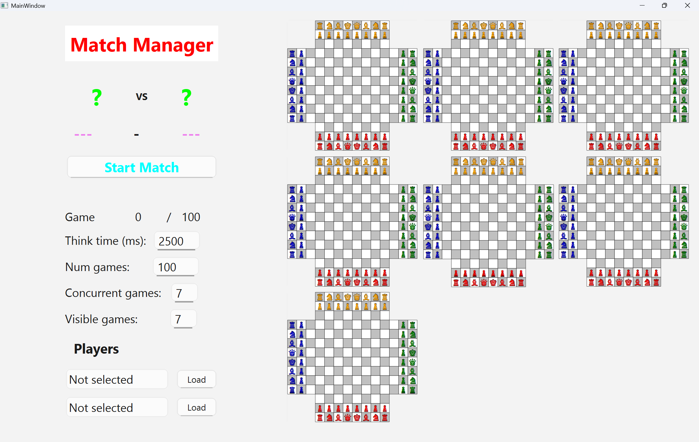
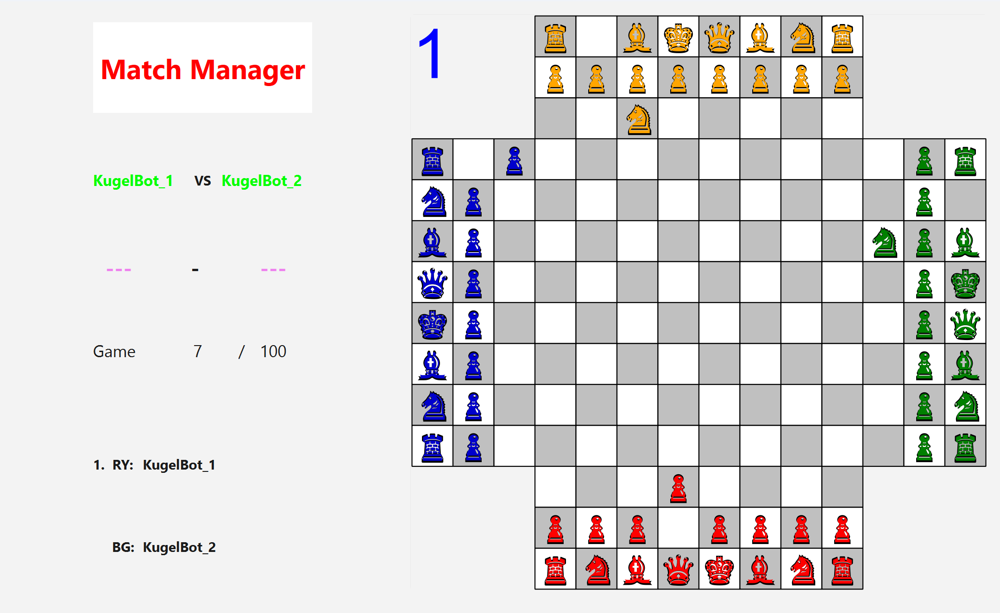
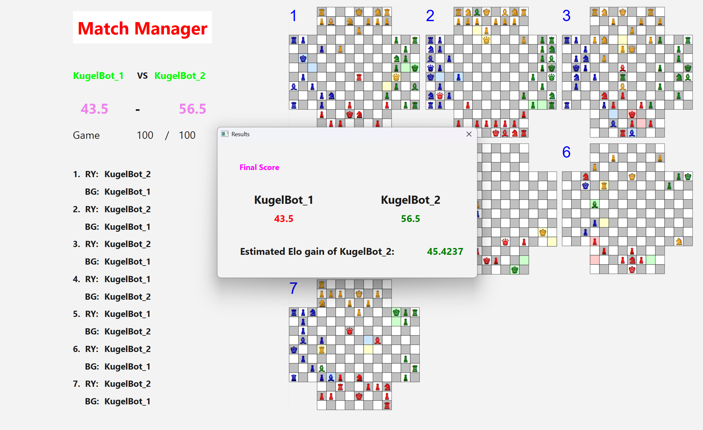

# Match Manager

A GUI-tool built with **Qt 6** and **C++17** for testing the strength of 4 player chess engines.

---

## Table of Contents
- [About](#about)
- [What can you do with it?](#what-can-you-do-with-it)

---

## About

You can use this application to run matches between two different engine versions whilst observing their gameplay.

### Main Menu

Here is where you configure all parameters. It is recommended to adjust the number of games running concurrently to the number of physical cores available to your system. If your engine runs on multiple cores take that into consideration as well. You can choose to observe fewer games than are running concurrently.

Start the match once you've set all parameters.

### Game in Progress

Games always start in a random starting position. Results are adjucated early when evaluations of both engines pass a certain threshold. After 300 moves games also will be terminated and results determined based on both engines evaluations.

### Result Window

Once all games are finished a window will pop up, displaying the final outcome of the match.

---

## What can you do with it?

Nothing as of now, as this project is not yet UCI-compatible.

---
